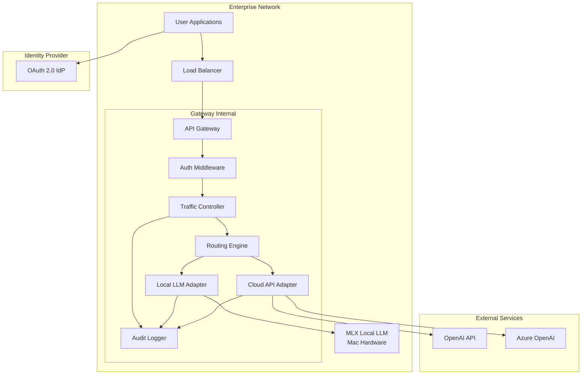
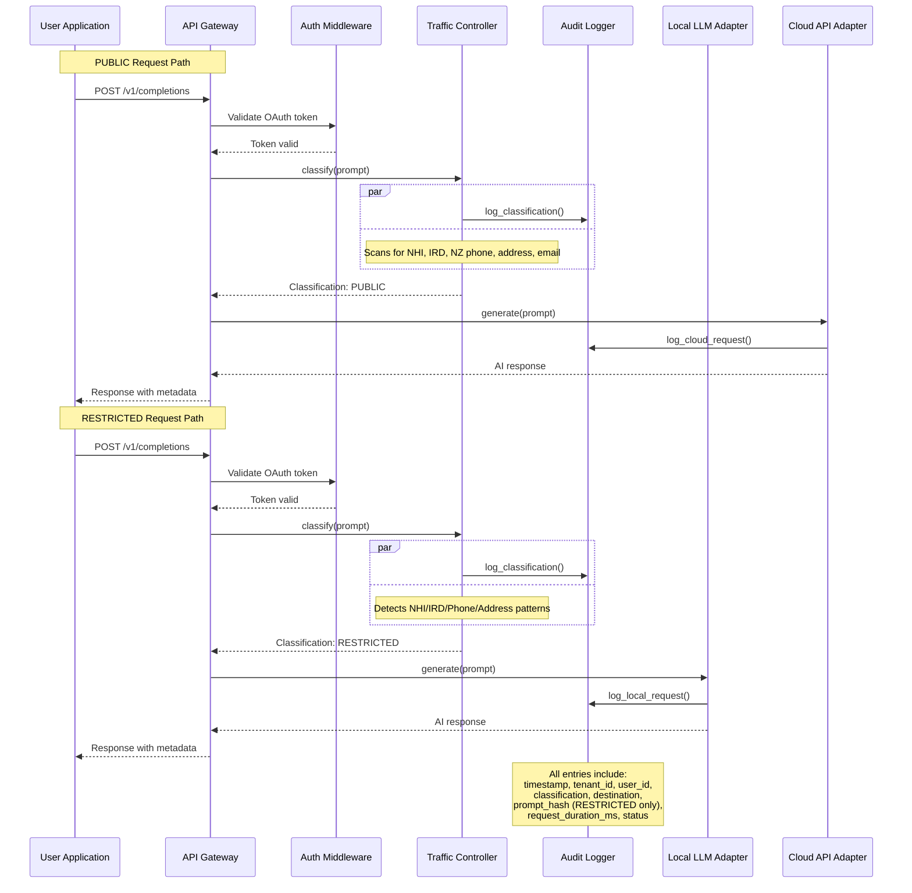
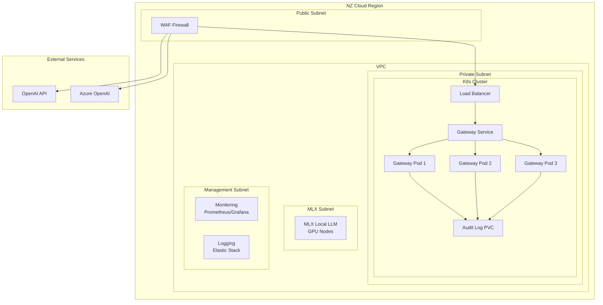
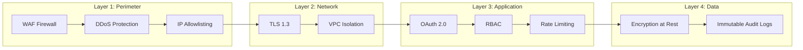
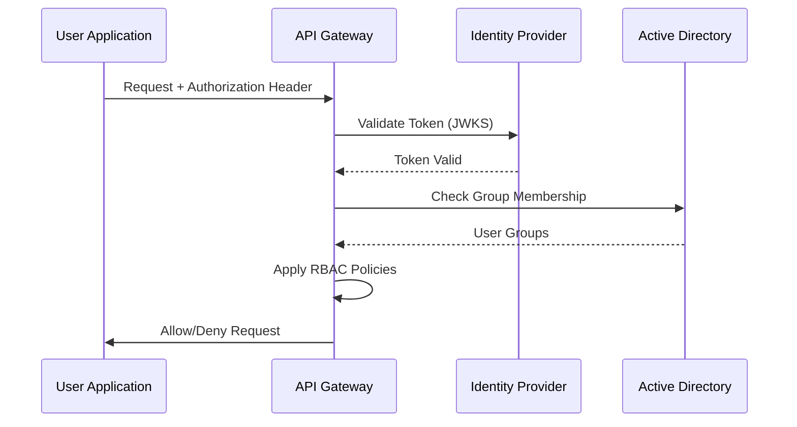
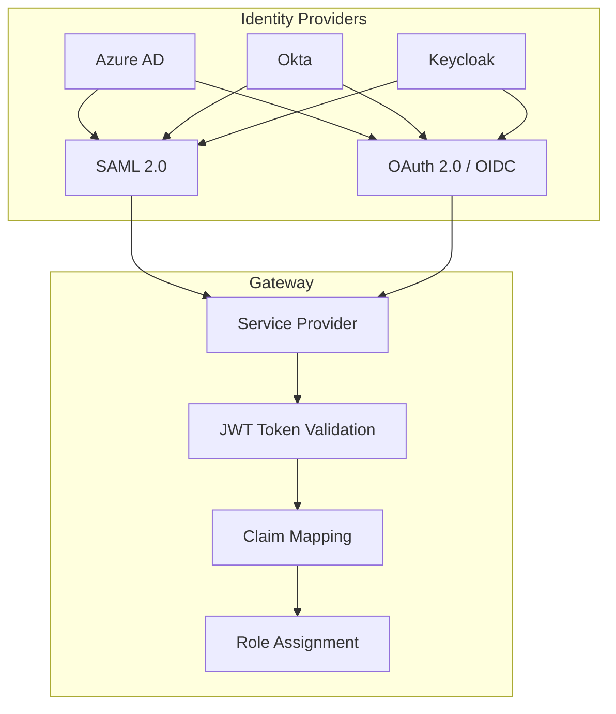

# Design Document: NZ Privacy-First Enterprise AI Gateway

## Overview

The NZ Privacy-First Enterprise AI Gateway is a hybrid LLM routing system designed for New Zealand government, finance, and legal organizations. It acts as an intelligent middleware layer between enterprise users and AI models, ensuring compliance with the Privacy Act 2020 and data sovereignty requirements. The gateway classifies incoming prompts for PII content and routes them to appropriate AI backends—local MLX models for sensitive data and cloud APIs (OpenAI/Azure) for non-sensitive requests—while maintaining a comprehensive, privacy-compliant audit trail.

## Architecture



## Components and Interfaces

### API Gateway

The API Gateway serves as the primary entry point for all AI requests. It handles TLS termination, request validation, authentication enforcement, and request routing to internal components.

```python
from fastapi import FastAPI, Request, HTTPException, Depends
from pydantic import BaseModel, Field
from typing import Optional, Dict, Any
from datetime import datetime
from enum import Enum

class Classification(str, Enum):
    PUBLIC = "PUBLIC"
    RESTRICTED = "RESTRICTED"

class GatewayConfig(BaseModel):
    local_llm_url: str
    cloud_provider: str  # "openai" or "azure"
    cloud_api_key: str
    azure_endpoint: Optional[str] = None
    tenant_id: str
    rate_limit_rpm: int = 100
```

### Traffic Controller (PII Detection)

The Traffic Controller scans incoming prompts for NZ-specific PII patterns using regex-based detection. It classifies each request as PUBLIC or RESTRICTED based on detected sensitive data.

```python
import re
from dataclasses import dataclass
from typing import List, Tuple

@dataclass
class PIIMatch:
    pattern_name: str
    matched_text: str
    start_position: int
    end_position: int

@dataclass
class ClassificationResult:
    classification: Classification
    pii_matches: List[PIIMatch]
    processing_time_ms: float

class NZPIIDetector:
    """
    New Zealand specific PII detection using regex patterns.
    
    Comprehensive coverage for:
    - Government identifiers (NHI, IRD, Driver Licence, Passport)
    - Financial data (Bank accounts, Credit cards)
    - Contact information (Phone, Email, Address)
    - Personal identifiers (Dates of birth, Names)
    - Cross-border identifiers (Australian TFN)
    - NZ government programs (WINZ, ACC, KiwiSaver)
    """
    
    # NHI (National Health Index) - 7 character alphanumeric format
    NHI_PATTERN = re.compile(
        r'\b[A-Z]{3}[A-Z0-9]{4}\b',
        re.IGNORECASE
    )
    
    # IRD (Inland Revenue Department) - 9 digit format
    IRD_PATTERN = re.compile(
        r'\b\d{9}\b'
    )
    
    # NZ Driver Licence - 8-10 character alphanumeric format
    DRIVER_LICENCE_PATTERN = re.compile(
        r'\b(?:DL\s?)?[A-Z]{1,2}[0-9]{5,7}\b',
        re.IGNORECASE
    )
    
    # NZ Passport - 9 digit format (modern e-passport)
    NZ_PASSPORT_PATTERN = re.compile(
        r'\b[AZ]{2}[0-9]{7}\b',
        re.IGNORECASE
    )
    
    # NZ Bank Account - 15-16 digit format (ASB, ANZ, BNZ, Westpac, etc.)
    NZ_BANK_ACCOUNT_PATTERN = re.compile(
        r'\b(?:01|02|03|04|05|06|07|08|09|10|11|12|13|14|15|16|17|18|19|20|21|22|23|24|25|26|27|28|29|30|31)-[0-9]{2,4}-[0-9]{7,8}\b'
    )
    
    # Credit Card - 13-19 digits with common patterns
    CREDIT_CARD_PATTERN = re.compile(
        r'\b(?:4[0-9]{12}(?:[0-9]{3})?|5[1-5][0-9]{14}|3[47][0-9]{13}|6(?:011|5[0-9]{2})[0-9]{12}|(?:2131|1800|35\d{3})\d{11})\b'
    )
    
    # NZ phone numbers - multiple formats (mobile, landline, international)
    NZ_PHONE_PATTERN = re.compile(
        r'\b(?:\+?64|0)(?:[2-9]\d{7,8}|(?:[2-9]\d\s?){7,8})\b'
    )
    
    # NZ postal addresses - comprehensive street address detection
    NZ_ADDRESS_PATTERN = re.compile(
        r'\b\d+\s+[A-Za-z]+\s+(?:Street|Road|Avenue|Lane|Drive|Court|Place|Road|Boulevard|Esplanade|Terrace|Crescent|Hill|Gardens|Park|Way|Alley|Square)\b',
        re.IGNORECASE
    )
    
    # NZ postal box (PO Box) addresses
    NZ_POBOX_PATTERN = re.compile(
        r'\b(?:PO\s?Box|Private\s?Bag|Post\s?Box)\s*#?\s*\d+\b',
        re.IGNORECASE
    )
    
    # Email addresses - all NZ domains plus general patterns
    NZ_EMAIL_PATTERN = re.compile(
        r'\b[A-Za-z0-9._%+-]+@(?:[A-Za-z0-9-]+\.)+(?:govt\.nz|co\.nz|ac\.nz|org\.nz|net\.nz|govt\.au|com\.au|edu\.au)\b',
        re.IGNORECASE
    )
    
    # Date of Birth - various NZ date formats
    DOB_PATTERN = re.compile(
        r'\b(?:0?[1-9]|[12][0-9]|3[01])[\/\-](?:0?[1-9]|1[0-2])[\/\-](?:19|20)\d{2}\b'
    )
    
    # Tax File Number (Australia - for cross-border)
    TFN_PATTERN = re.compile(
        r'\b\d{3}[\s\-]?\d{3}[\s\-]?\d{3}\b'
    )
    
    # WINZ Client Reference (Work and Income NZ)
    WINZ_PATTERN = re.compile(
        r'\b(?:WINZ|MSD)\s*[#]?\s*[A-Z0-9]{6,10}\b',
        re.IGNORECASE
    )
    
    # ACC Client Number (Accident Compensation Corporation)
    ACC_PATTERN = re.compile(
        r'\bACC\s*[#]?\s*[0-9]{8,10}\b',
        re.IGNORECASE
    )
    
    # KiwiSaver account numbers
    KIWI_SAVER_PATTERN = re.compile(
        r'\b(?:KS|KiwiSaver)\s*[#]?\s*[0-9]{6,12}\b',
        re.IGNORECASE
    )
    
    # General financial amounts with currency (for detecting salary/financial data)
    FINANCIAL_AMOUNT_PATTERN = re.compile(
        r'\$[\d,]+(?:\.\d{2})?(?:\s*(?:NZD|AUD|USD|EUR|GBP))?|\b(?:NZD|AUD|USD|EUR|GBP)\s*\$?[\d,]+(?:\.\d{2})?\b',
        re.IGNORECASE
    )
    
    def classify(self, prompt: str) -> ClassificationResult:
        """Scan prompt for PII and return classification."""
        start_time = datetime.utcnow()
        pii_matches: List[PIIMatch] = []
        
        # Scan for all PII patterns
        for pattern_name, pattern in self._get_patterns():
            for match in pattern.finditer(prompt):
                pii_matches.append(PIIMatch(
                    pattern_name=pattern_name,
                    matched_text=self._mask_pii(match.group()),
                    start_position=match.start(),
                    end_position=match.end()
                ))
        
        processing_time = (datetime.utcnow() - start_time).total_seconds() * 1000
        
        classification = Classification.RESTRICTED if pii_matches else Classification.PUBLIC
        
        return ClassificationResult(
            classification=classification,
            pii_matches=pii_matches,
            processing_time_ms=processing_time
        )
    
    def _get_patterns(self) -> List[Tuple[str, re.Pattern]]:
        return [
            ("NHI", self.NHI_PATTERN),
            ("IRD", self.IRD_PATTERN),
            ("DRIVER_LICENCE", self.DRIVER_LICENCE_PATTERN),
            ("PASSPORT", self.NZ_PASSPORT_PATTERN),
            ("BANK_ACCOUNT", self.NZ_BANK_ACCOUNT_PATTERN),
            ("CREDIT_CARD", self.CREDIT_CARD_PATTERN),
            ("NZ_PHONE", self.NZ_PHONE_PATTERN),
            ("NZ_ADDRESS", self.NZ_ADDRESS_PATTERN),
            ("NZ_POBOX", self.NZ_POBOX_PATTERN),
            ("NZ_EMAIL", self.NZ_EMAIL_PATTERN),
            ("DOB", self.DOB_PATTERN),
            ("TFN", self.TFN_PATTERN),
            ("WINZ", self.WINZ_PATTERN),
            ("ACC", self.ACC_PATTERN),
            ("KIWI_SAVER", self.KIWI_SAVER_PATTERN),
            ("FINANCIAL_AMOUNT", self.FINANCIAL_AMOUNT_PATTERN),
        ]
    
    def _mask_pii(self, text: str) -> str:
        """Mask PII for safe logging."""
        if len(text) <= 4:
            return "*" * len(text)
        return text[:2] + "*" * (len(text) - 4) + text[-2:]
```

### Routing Engine

The Routing Engine makes routing decisions based on classification results and routes requests to appropriate AI backends.

```python
from abc import ABC, abstractmethod
from typing import AsyncGenerator
from enum import Enum

class Destination(Enum):
    LOCAL_LLM = "local_llm"
    CLOUD_API = "cloud_api"

class BaseAdapter(ABC):
    @abstractmethod
    async def generate(self, prompt: str, **kwargs) -> str:
        pass
    
    @abstractmethod
    async def stream_generate(self, prompt: str, **kwargs) -> AsyncGenerator[str, None]:
        pass
    
    @abstractmethod
    async def health_check(self) -> bool:
        pass

class RoutingEngine:
    """Routes requests based on classification results."""
    
    def __init__(
        self,
        local_adapter: BaseAdapter,
        cloud_adapter: BaseAdapter,
        pii_detector: NZPIIDetector
    ):
        self.local_adapter = local_adapter
        self.cloud_adapter = cloud_adapter
        self.pii_detector = pii_detector
    
    async def route_request(
        self,
        prompt: str,
        user_id: str,
        tenant_id: str,
        **kwargs
    ) -> Tuple[Destination, str]:
        """
        Route request to appropriate AI backend.
        
        Preconditions:
        - prompt is non-empty string
        - user_id is valid UUID
        - tenant_id is valid string
        
        Postconditions:
        - Returns (destination, response) tuple
        - Response contains AI-generated content
        - No PII is transmitted to cloud for RESTRICTED requests
        """
        # Classify the prompt
        result = self.pii_detector.classify(prompt)
        
        # Route based on classification
        if result.classification == Classification.RESTRICTED:
            destination = Destination.LOCAL_LLM
            if not await self.local_adapter.health_check():
                raise RuntimeError("Local LLM unavailable for RESTRICTED request")
            response = await self.local_adapter.generate(prompt, **kwargs)
        else:
            destination = Destination.CLOUD_API
            response = await self.cloud_adapter.generate(prompt, **kwargs)
        
        return destination, response
```

### Local LLM Adapter

Adapter for MLX-based local models running on Mac hardware.

```python
import httpx
from typing import AsyncGenerator

class LocalLLMAdapter(BaseAdapter):
    """Adapter for MLX local LLM running on Mac hardware."""
    
    def __init__(self, base_url: str, timeout: float = 120.0):
        self.base_url = base_url.rstrip("/")
        self.timeout = timeout
        self._client: Optional[httpx.AsyncClient] = None
    
    async def _get_client(self) -> httpx.AsyncClient:
        if self._client is None:
            self._client = httpx.AsyncClient(timeout=self.timeout)
        return self._client
    
    async def generate(self, prompt: str, **kwargs) -> str:
        """
        Generate response from local MLX model.
        
        Preconditions:
        - MLX server is running and healthy
        - prompt length within model limits
        
        Postconditions:
        - Returns generated text response
        - No data leaves local network
        """
        client = await self._get_client()
        
        payload = {
            "prompt": prompt,
            "max_tokens": kwargs.get("max_tokens", 1024),
            "temperature": kwargs.get("temperature", 0.7),
            "stream": False
        }
        
        response = await client.post(
            f"{self.base_url}/v1/completions",
            json=payload
        )
        response.raise_for_status()
        
        return response.json()["choices"][0]["text"]
    
    async def stream_generate(self, prompt: str, **kwargs) -> AsyncGenerator[str, None]:
        """Stream response from local MLX model."""
        client = await self._get_client()
        
        payload = {
            "prompt": prompt,
            "max_tokens": kwargs.get("max_tokens", 1024),
            "temperature": kwargs.get("temperature", 0.7),
            "stream": True
        }
        
        async with client.stream(
            "POST",
            f"{self.base_url}/v1/completions",
            json=payload
        ) as response:
            async for line in response.aiter_lines():
                if line.startswith("data: "):
                    data = line[6:]
                    if data != "[DONE]":
                        chunk = json.loads(data)
                        if "choices" in chunk:
                            yield chunk["choices"][0]["text"]
    
    async def health_check(self) -> bool:
        """Check if local LLM is available."""
        try:
            client = await self._get_client()
            response = await client.get(f"{self.base_url}/health")
            return response.status_code == 200
        except Exception:
            return False
    
    async def close(self):
        if self._client:
            await self._client.aclose()
            self._client = None
```

### Cloud API Adapter

Adapter for OpenAI and Azure OpenAI APIs.

```python
import json
from typing import AsyncGenerator

class CloudAPIAdapter(BaseAdapter):
    """Adapter for OpenAI and Azure OpenAI APIs."""
    
    def __init__(
        self,
        provider: str,
        api_key: str,
        azure_endpoint: Optional[str] = None,
        organization: Optional[str] = None
    ):
        self.provider = provider.lower()
        self.api_key = api_key
        self.azure_endpoint = azure_endpoint
        self.organization = organization
        self._client: Optional[httpx.AsyncClient] = None
        
        self._configure_endpoints()
    
    def _configure_endpoints(self):
        if self.provider == "azure" and self.azure_endpoint:
            self.base_url = self.azure_endpoint.rstrip("/")
            self.api_version = "2024-02-15-preview"
        else:
            self.base_url = "https://api.openai.com/v1"
    
    async def _get_client(self) -> httpx.AsyncClient:
        if self._client is None:
            headers = {"Authorization": f"Bearer {self.api_key}"}
            if self.organization:
                headers["OpenAI-Organization"] = self.organization
            self._client = httpx.AsyncClient(
                headers=headers,
                timeout=60.0
            )
        return self._client
    
    async def generate(self, prompt: str, **kwargs) -> str:
        """
        Generate response from cloud API.
        
        Preconditions:
        - API key is valid and has sufficient quota
        - prompt contains no PII (enforced by Traffic Controller)
        
        Postconditions:
        - Returns generated text response
        - API key not exposed in logs
        """
        client = await self._get_client()
        
        model = kwargs.get("model", "gpt-4")
        
        payload = {
            "model": model,
            "messages": [{"role": "user", "content": prompt}],
            "max_tokens": kwargs.get("max_tokens", 1024),
            "temperature": kwargs.get("temperature", 0.7)
        }
        
        endpoint = f"{self.base_url}/chat/completions"
        if self.provider == "azure":
            endpoint += f"?api-version={self.api_version}"
        
        response = await client.post(endpoint, json=payload)
        response.raise_for_status()
        
        return response.json()["choices"][0]["message"]["content"]
    
    async def stream_generate(self, prompt: str, **kwargs) -> AsyncGenerator[str, None]:
        """Stream response from cloud API."""
        client = await self._get_client()
        
        payload = {
            "model": kwargs.get("model", "gpt-4"),
            "messages": [{"role": "user", "content": prompt}],
            "stream": True
        }
        
        endpoint = f"{self.base_url}/chat/completions"
        if self.provider == "azure":
            endpoint += f"?api-version={self.api_version}"
        
        async with client.stream("POST", endpoint, json=payload) as response:
            async for line in response.aiter_lines():
                if line.startswith("data: "):
                    data = line[6:]
                    if data != "[DONE]":
                        chunk = json.loads(data)
                        if "choices" in chunk:
                            delta = chunk["choices"][0].get("delta", {})
                            if "content" in delta:
                                yield delta["content"]
    
    async def health_check(self) -> bool:
        """Check if cloud API is available."""
        try:
            client = await self._get_client()
            response = await client.get(f"{self.base_url}/models")
            return response.status_code == 200
        except Exception:
            return False
    
    async def close(self):
        if self._client:
            await self._client.aclose()
            self._client = None
```

### Audit Logger

Privacy-compliant audit logging that never stores PII or prompt content.

```python
import json
import hashlib
from datetime import datetime
from typing import Optional
from dataclasses import dataclass, asdict
from enum import Enum

class RequestStatus(Enum):
    SUCCESS = "success"
    ERROR = "error"
    TIMEOUT = "timeout"

@dataclass
class AuditLogEntry:
    """Immutable audit log entry - never includes PII or prompt content."""
    timestamp: str  # ISO 8601
    tenant_id: str
    user_id: str
    request_id: str
    classification: str  # PUBLIC or RESTRICTED
    destination: str  # local_llm or cloud_api
    pii_patterns_detected: list[str]  # Pattern names only, no actual PII
    prompt_hash: Optional[str]  # SHA-256 hash for correlation, not storage
    request_duration_ms: float
    status: str
    error_message: Optional[str] = None
    model_used: Optional[str] = None
    token_count: Optional[int] = None
    
    def to_dict(self) -> dict:
        return asdict(self)
    
    def to_json(self) -> str:
        return json.dumps(self.to_dict())

class AuditLogger:
    """Privacy-compliant audit logger for NZ Privacy Act 2020 compliance."""
    
    def __init__(self, storage_path: str):
        self.storage_path = storage_path
        self._buffer: list[AuditLogEntry] = []
        self._buffer_size = 100
        self._flush_interval = 30.0  # seconds
    
    def log_request(
        self,
        tenant_id: str,
        user_id: str,
        request_id: str,
        classification: Classification,
        destination: Destination,
        pii_matches: list[PIIMatch],
        prompt: str,
        duration_ms: float,
        status: RequestStatus,
        error_message: Optional[str] = None,
        model_used: Optional[str] = None
    ) -> AuditLogEntry:
        """
        Create audit log entry without storing PII or prompt content.
        
        Preconditions:
        - tenant_id and user_id are valid identifiers
        - request_id is unique UUID
        
        Postconditions:
        - AuditLogEntry created with no PII or prompt content
        - prompt_hash allows correlation without disclosure
        - Entry is immutable once created
        """
        entry = AuditLogEntry(
            timestamp=datetime.utcnow().isoformat() + "Z",
            tenant_id=tenant_id,
            user_id=user_id,
            request_id=request_id,
            classification=classification.value,
            destination=destination.value,
            pii_patterns_detected=[m.pattern_name for m in pii_matches],
            prompt_hash=self._hash_prompt(prompt) if classification == Classification.RESTRICTED else None,
            request_duration_ms=duration_ms,
            status=status.value,
            error_message=error_message,
            model_used=model_used
        )
        
        self._buffer.append(entry)
        
        if len(self._buffer) >= self._buffer_size:
            self._flush()
        
        return entry
    
    def _hash_prompt(self, prompt: str) -> str:
        """Create SHA-256 hash for correlation without disclosure."""
        return hashlib.sha256(prompt.encode()).hexdigest()
    
    def _flush(self):
        """Flush buffer to persistent storage."""
        if not self._buffer:
            return
        
        timestamp = datetime.utcnow().strftime("%Y%m%d_%H%M%S")
        filename = f"{self.storage_path}/audit_{timestamp}.jsonl"
        
        with open(filename, "a") as f:
            for entry in self._buffer:
                f.write(entry.to_json() + "\n")
        
        self._buffer.clear()
    
    async def flush_async(self):
        """Async flush for use in request handlers."""
        self._flush()
```

## Data Models

### Request/Response Schemas

```python
from pydantic import BaseModel, Field
from typing import List, Optional
from datetime import datetime

class AIRequest(BaseModel):
    """Incoming AI request from user."""
    prompt: str = Field(..., min_length=1, max_length=32000)
    user_id: str = Field(..., description="User identifier from auth")
    tenant_id: str = Field(..., description="Tenant organization ID")
    model: Optional[str] = Field(None, description="Model override")
    max_tokens: Optional[int] = Field(None, ge=1, le=8192)
    temperature: Optional[float] = Field(None, ge=0.0, le=2.0)
    stream: Optional[bool] = Field(False)

class AIResponse(BaseModel):
    """AI response to user."""
    response_id: str
    content: str
    classification: Classification
    destination: str
    model_used: str
    request_duration_ms: float
    created_at: datetime

class ClassificationResponse(BaseModel):
    """Response from PII classification."""
    classification: Classification
    pii_patterns_found: List[str]
    processing_time_ms: float

class ErrorResponse(BaseModel):
    """Error response."""
    error: str
    error_code: str
    request_id: str
    timestamp: str
```

### Tenant Configuration

```python
from pydantic import BaseModel
from typing import Dict, Any

class TenantConfig(BaseModel):
    """Per-tenant configuration."""
    tenant_id: str
    tenant_name: str
    local_llm_enabled: bool = True
    cloud_provider: str = "openai"
    cloud_api_key_encrypted: str
    azure_endpoint: Optional[str] = None
    allowed_models: List[str] = ["gpt-4", "gpt-3.5-turbo"]
    rate_limit_rpm: int = 100
    ip_whitelist: List[str] = []
    audit_retention_days: int = 2555  # 7 years minimum
```

## Sequence Diagram



## Algorithmic Pseudocode

### Main Request Processing Algorithm

```pascal
ALGORITHM processAIRequest(request)
INPUT: request of type AIRequest
OUTPUT: response of type AIResponse

BEGIN
  // Step 1: Validate authentication
  auth_result ← validateAuth(request.auth_token)
  IF NOT auth_result.valid THEN
    RETURN Error("Unauthorized", 401)
  END IF
  
  // Step 2: Rate limiting check
  IF NOT checkRateLimit(auth_result.user_id, auth_result.tenant_id) THEN
    RETURN Error("Rate limit exceeded", 429)
  END IF
  
  // Step 3: PII Classification
  start_time ← now()
  classification_result ← classifyPIIContent(request.prompt)
  
  // Step 4: Log classification decision
  audit_entry ← createAuditEntry(
    tenant_id = auth_result.tenant_id,
    user_id = auth_result.user_id,
    classification = classification_result.classification,
    pii_patterns = classification_result.patterns
  )
  writeAuditLog(audit_entry)
  
  // Step 5: Route based on classification
  IF classification_result.classification = "RESTRICTED" THEN
    // Step 5a: Route to local LLM
    IF NOT healthCheckLocalLLM() THEN
      RETURN Error("Local LLM unavailable", 503)
    END IF
    
    response ← callLocalLLM(request.prompt)
    destination ← "local_llm"
  ELSE
    // Step 5b: Route to cloud API
    response ← callCloudAPI(request.prompt)
    destination ← "cloud_api"
  END IF
  
  // Step 6: Finalize audit log
  audit_entry.request_duration_ms ← now() - start_time
  audit_entry.status ← "success"
  updateAuditLog(audit_entry)
  
  // Step 7: Return response
  RETURN AIResponse(
    content = response,
    classification = classification_result.classification,
    destination = destination,
    request_duration_ms = audit_entry.request_duration_ms
  )
END
```

### PII Detection Algorithm

```pascal
ALGORITHM classifyPIIContent(text)
INPUT: text of type String
OUTPUT: classification_result of type ClassificationResult

BEGIN
  patterns ← [
    ("NHI", NHI_REGEX),
    ("IRD", IRD_REGEX),
    ("NZ_PHONE", NZ_PHONE_REGEX),
    ("NZ_ADDRESS", NZ_ADDRESS_REGEX),
    ("NZ_EMAIL", NZ_EMAIL_REGEX)
  ]
  
  detected_patterns ← []
  
  FOR EACH (name, pattern) IN patterns DO
    matches ← pattern.findAll(text)
    FOR EACH match IN matches DO
      detected_patterns.append(name)
    END FOR
  END FOR
  
  IF detected_patterns.length > 0 THEN
    RETURN ClassificationResult(
      classification = "RESTRICTED",
      patterns = detected_patterns,
      processing_time_ms = 0
    )
  ELSE
    RETURN ClassificationResult(
      classification = "PUBLIC",
      patterns = [],
      processing_time_ms = 0
    )
  END IF
END
```

### Audit Log Creation Algorithm

```pascal
ALGORITHM createAuditEntry(params)
INPUT: params containing tenant_id, user_id, request_id, classification, pii_patterns, prompt
OUTPUT: audit_entry of type AuditLogEntry

BEGIN
  // Create immutable entry - NO PII or prompt content stored
  entry ← AuditLogEntry(
    timestamp = currentISO8601(),
    tenant_id = params.tenant_id,
    user_id = params.user_id,
    request_id = params.request_id,
    classification = params.classification,
    destination = "",  // Set by caller
    pii_patterns_detected = params.pii_patterns,  // Pattern names only
    prompt_hash = hashSHA256(params.prompt) IF params.classification = "RESTRICTED" ELSE null,
    request_duration_ms = 0,  // Set after request completes
    status = "pending",  // Updated by caller
    error_message = null
  )
  
  // Write to immutable storage
  appendToFile(audit_storage_path, entry.toJSON())
  
  RETURN entry
END
```

## Correctness Properties

```python
# Property-based tests for core functionality

def test_pii_classification_properties():
    """
    Properties that must hold for PII classification:
    1. Empty prompt is always PUBLIC
    2. Prompt with NHI is RESTRICTED
    3. Prompt with IRD is RESTRICTED
    4. Prompt with NZ phone is RESTRICTED
    5. Prompt with NZ address is RESTRICTED
    6. Prompt with NZ email is RESTRICTED
    7. Prompt without PII is PUBLIC
    """
    detector = NZPIIDetector()
    
    # Property 1: Empty prompt is PUBLIC
    result = detector.classify("")
    assert result.classification == Classification.PUBLIC
    
    # Property 2-6: PII prompts are RESTRICTED
    pii_prompts = [
        "My NHI is ABC1234D",
        "IRD number is 123456789",
        "Call me at 0211234567",
        "I live at 123 Queen Street",
        "Email me at john.doe@govt.nz"
    ]
    for prompt in pii_prompts:
        result = detector.classify(prompt)
        assert result.classification == Classification.RESTRICTED, f"Failed for: {prompt}"
    
    # Property 7: Non-PII prompt is PUBLIC
    result = detector.classify("What is the capital of New Zealand?")
    assert result.classification == Classification.PUBLIC

def test_audit_log_never_contains_pii():
    """
    Property: Audit logs never contain actual PII or prompt content.
    """
    logger = AuditLogger("/tmp/audit")
    
    sensitive_prompt = "My NHI is ABC1234D and IRD is 123456789"
    
    entry = logger.log_request(
        tenant_id="tenant-123",
        user_id="user-456",
        request_id="req-789",
        classification=Classification.RESTRICTED,
        destination=Destination.LOCAL_LLM,
        pii_matches=[PIIMatch("NHI", "ABC1234D", 10, 18)],
        prompt=sensitive_prompt,
        duration_ms=150.0,
        status=RequestStatus.SUCCESS
    )
    
    # Verify no PII in entry
    entry_dict = entry.to_dict()
    for key, value in entry_dict.items():
        if isinstance(value, str):
            assert "ABC1234D" not in value, f"PII found in {key}"
            assert "123456789" not in value, f"PII found in {key}"
    
    # Verify prompt hash exists for RESTRICTED
    assert entry.prompt_hash is not None
    assert len(entry.prompt_hash) == 64  # SHA-256 hex length

def test_routing_consistency():
    """
    Property: Same classification always routes to same destination.
    """
    engine = create_test_routing_engine()
    
    # Same PII content should always route to local
    pii_prompt = "My NHI is ABC1234D"
    for _ in range(10):
        dest, _ = asyncio.run(engine.route_request(
            pii_prompt, "user-1", "tenant-1"
        ))
        assert dest == Destination.LOCAL_LLM
    
    # Same non-PII content should always route to cloud
    public_prompt = "What is 2+2?"
    for _ in range(10):
        dest, _ = asyncio.run(engine.route_request(
            public_prompt, "user-1", "tenant-1"
        ))
        assert dest == Destination.CLOUD_API
```

## Error Handling

```python
from fastapi import HTTPException
from typing import Optional

class GatewayError(Exception):
    """Base gateway error."""
    def __init__(self, message: str, error_code: str, status_code: int = 500):
        self.message = message
        self.error_code = error_code
        self.status_code = status_code
        super().__init__(message)

class AuthenticationError(GatewayError):
    """Authentication failed."""
    def __init__(self, message: str = "Authentication failed"):
        super().__init__(message, "AUTH_ERROR", 401)

class RateLimitError(GatewayError):
    """Rate limit exceeded."""
    def __init__(self, retry_after: int = 60):
        super().__init__(
            f"Rate limit exceeded. Retry after {retry_after} seconds",
            "RATE_LIMIT",
            429,
        )
        self.retry_after = retry_after

class LocalLLLMUnavailableError(GatewayError):
    """Local LLM is unavailable."""
    def __init__(self):
        super().__init__(
            "Local LLM unavailable for RESTRICTED request",
            "LOCAL_LLM_UNAVAILABLE",
            503
        )

class CloudAPIError(GatewayError):
    """Cloud API error with retry info."""
    def __init__(self, message: str, retries_left: int = 3):
        super().__init__(message, "CLOUD_API_ERROR", 502)
        self.retries_left = retries_left

def handle_gateway_error(exc: GatewayError) -> dict:
    """Convert gateway error to response."""
    return {
        "error": exc.message,
        "error_code": exc.error_code,
        "status_code": exc.status_code
    }
```

## Example Usage

```python
# Example 1: Processing a PUBLIC request
async def example_public_request():
    """Example: Non-sensitive request routed to cloud API."""
    request = AIRequest(
        prompt="What are the key principles of the Privacy Act 2020?",
        user_id="user-123",
        tenant_id="tenant-abc",
        model="gpt-4"
    )
    
    # Traffic Controller classifies as PUBLIC
    result = pii_detector.classify(request.prompt)
    # result.classification == Classification.PUBLIC
    
    # Routing Engine sends to cloud
    destination, response = await routing_engine.route_request(
        request.prompt,
        request.user_id,
        request.tenant_id
    )
    # destination == Destination.CLOUD_API

# Example 2: Processing a RESTRICTED request
async def example_restricted_request():
    """Example: Sensitive request routed to local LLM."""
    request = AIRequest(
        prompt="Please analyze this patient data. NHI: ABC1234D",
        user_id="user-456",
        tenant_id="tenant-xyz"
    )
    
    # Traffic Controller detects NHI
    result = pii_detector.classify(request.prompt)
    # result.classification == Classification.RESTRICTED
    # "NHI" in result.pii_patterns
    
    # Routing Engine sends to local LLM
    destination, response = await routing_engine.route_request(
        request.prompt,
        request.user_id,
        request.tenant_id
    )
    # destination == Destination.LOCAL_LLM
    # Response never leaves local network

# Example 3: Audit log entry (no PII stored)
def example_audit_entry():
    """Example: Audit log entry contains no PII."""
    entry = audit_logger.log_request(
        tenant_id="tenant-abc",
        user_id="user-123",
        request_id="req-789",
        classification=Classification.RESTRICTED,
        destination=Destination.LOCAL_LLM,
        pii_matches=[PIIMatch("NHI", "ABC1234D", 10, 18)],
        prompt="My NHI is ABC1234D",
        duration_ms=150.0,
        status=RequestStatus.SUCCESS
    )
    
    # Entry contains:
    # - timestamp, tenant_id, user_id, request_id
    # - classification: "RESTRICTED"
    # - destination: "local_llm"
    # - pii_patterns_detected: ["NHI"]  # Pattern name only
    # - prompt_hash: "abc123..."  # Hash, not content
    # - request_duration_ms: 150.0
    # - status: "success"
    
    # Entry does NOT contain:
    # - Original prompt text
    # - Actual NHI value "ABC1234D"
```

## Performance Considerations

- PII classification completes within 50ms for typical prompts
- Routing decision adds minimal overhead (<5ms)
- Local LLM requests: 100-500ms depending on model size
- Cloud API requests: 200-2000ms depending on provider latency
- Audit logging is asynchronous to avoid blocking requests
- Connection pooling for both local and cloud endpoints
- Circuit breaker pattern prevents cascade failures

## Security Considerations

- All data in transit encrypted via TLS 1.3
- OAuth 2.0 authentication required for all requests
- API keys stored encrypted, never logged
- Input validation prevents prompt injection attacks
- Rate limiting prevents abuse
- IP allowlisting available for additional control
- RESTRICTED data never transmitted to cloud APIs
- Audit logs immutable and retained for 7 years

## Dependencies

- FastAPI for API gateway
- httpx for async HTTP clients
- pydantic for data validation
- regex for PII pattern matching
- Python 3.10+
## Dependencies

- FastAPI for API gateway
- httpx for async HTTP clients
- pydantic for data validation
- regex for PII pattern matching
- Python 3.10+

## Deployment Architecture

### Kubernetes Deployment



### Deployment Specifications

| Component | Specification | Justification |
|-----------|---------------|---------------|
| Gateway Pods | 3 replicas minimum | High availability, load distribution |
| CPU | 2 cores per pod | Handle classification and routing |
| Memory | 4GB RAM per pod | PII detection, connection pooling |
| Storage | 50GB PVC for audit logs | 7-year retention requirement |
| MLX Nodes | GPU-enabled (M1/M2 Mac) | Local LLM inference |
| Auto-scaling | HPA 1-10 pods | Handle load spikes |
| Health Checks | Liveness/Readiness probes | Zero-downtime deployments |

### Network Architecture

| Zone | CIDR | Purpose | Security Groups |
|------|------|---------|-----------------|
| Public Subnet | 10.0.1.0/24 | WAF, Load Balancer | Allow HTTPS from Internet |
| Private Subnet | 10.0.2.0/24 | Gateway Pods | Allow from Public Subnet |
| MLX Subnet | 10.0.3.0/24 | Local LLM | Allow from Private Subnet only |
| Management Subnet | 10.0.4.0/24 | Monitoring, Logging | Restricted access |

## Security Architecture

### Defense in Depth



### Encryption Design

| Data State | Algorithm | Key Management | Implementation |
|------------|-----------|----------------|----------------|
| In Transit | TLS 1.3 | N/A | Automatic via load balancer |
| At Rest (Config) | AES-256 | AWS KMS / Azure Key Vault | Python cryptography library |
| At Rest (Audit Logs) | AES-256 | Customer-managed keys | Encrypted PVC |
| API Keys | N/A | Hash (never stored) | Environment variables, secrets manager |
| Tokens | JWT RS256 | IdP-managed | OAuth 2.0 flow |

### Authentication Flow



### Role-Based Access Control

| Role | Permissions | Use Case |
|------|-------------|----------|
| admin | Full access to all endpoints and configuration | System administrators |
| tenant_admin | Manage tenant configuration, view tenant metrics | Department heads |
| user | Access AI completion endpoints only | End users |
| auditor | Read-only access to audit logs | Compliance officers |
| monitor | Read-only access to metrics | SRE engineers |

## Threat Modeling (STRIDE)

| Threat | Asset | Attack Vector | Mitigation | Risk Level |
|--------|-------|---------------|------------|------------|
| **Spoofing** | User identity | Fake authentication tokens | OAuth 2.0 with JWKS validation | Low |
| **Tampering** | Audit logs | Modify log entries | Immutable storage, cryptographic hashing | Low |
| **Repudiation** | Request logs | Deny making requests | Comprehensive audit trail with timestamps | Low |
| **Information Disclosure** | PII data | Intercept RESTRICTED data | Local LLM only, TLS 1.3, encryption | Medium |
| **Denial of Service** | Gateway service | Flood with requests | Rate limiting, WAF, auto-scaling | Medium |
| **Elevation of Privilege** | Admin functions | Exploit RBAC gaps | Least privilege principle, regular audits | Low |

## Compliance Mapping

### NZ Privacy Act 2020 Compliance

| Principle | Requirement | Implementation |
|-----------|-------------|----------------|
| Principle 1: Purpose Collection | Collect personal info for lawful purposes | PII detection for routing only |
| Principle 2: Source | Collect from subject where practicable | N/A (processing only) |
| Principle 3: Collection | Don't collect more than necessary | PII patterns limited to 16 types |
| Principle 4: Storage | Protect against loss, access, disclosure | Encryption, access controls, local LLM |
| Principle 5: Retention | Keep only as long as necessary | 7-year audit retention, then purge |
| Principle 6: Access | Individuals can access their info | Audit logs available on request |
| Principle 7: Accuracy | Correct inaccurate info | N/A (no data modification) |
| Principle 8: Correction | Correct inaccurate info | N/A (no data modification) |
| Principle 9: Use | Use only for collection purpose | PII never leaves organization for RESTRICTED |
| Principle 10: Disclosure | Don't disclose without consent | Local LLM prevents disclosure |
| Principle 11: Unique Identifier | Use unique identifiers carefully | NHI/IRD detection only, not storage |

### ISO 27001 Controls

| Control | Implementation |
|---------|----------------|
| A.5.1 Policies for information security | Security policies documented |
| A.6.1.5 Security in job responsibilities | RBAC implementation |
| A.8.2 Privileged access rights | Admin roles with audit logging |
| A.9.1 Access control policy | Tenant isolation, authentication |
| A.10.1 Cryptographic controls | TLS 1.3, AES-256 encryption |
| A.12.4 Logging and monitoring | Comprehensive audit trail |
| A.13.1 Network security management | VPC, subnet isolation, WAF |
| A.14.2 Security in development processes | Code reviews, testing |
| A.16.1 Management of information security incidents | Incident response procedures |

### NZ Information Security Manual (NZISM) Compliance

| Control | Implementation |
|---------|----------------|
| 138-3: Classification of information | PUBLIC/RESTRICTED classification |
| 139-3: Access control | Tenant isolation, RBAC |
| 140-3: Cryptographic key management | KMS integration |
| 141-3: Cryptographic mechanisms | TLS 1.3, AES-256 |
| 142-3: Supply chain security | Vendor assessment, dependencies |

## Integration Architecture

### Enterprise IdP Integration



### SIEM Integration

| Platform | Integration Method | Format |
|----------|-------------------|--------|
| Splunk | HTTP Event Collector (HEC) | JSON |
| Elastic Stack | Logstash | JSON |
| QRadar | Syslog / CEF | CEF |
| Azure Sentinel | Log Analytics API | JSON |
| Custom Webhook | HTTP POST | JSON |

### Monitoring Integration

| Platform | Integration Method | Metrics |
|----------|-------------------|--------|
| Prometheus | Pull /metrics | All metrics |
| Grafana | Prometheus data source | Dashboards |
| Datadog | API | Custom metrics |
| New Relic | API | Custom metrics |
| CloudWatch | API | AWS-specific metrics |

## Operational Procedures

### Deployment Procedures

#### Zero-Downtime Deployment

```bash
# Kubernetes rolling update
kubectl set image deployment/gateway gateway=registry/gateway:v2.0 \
  --record=true

# Verify rollout
kubectl rollout status deployment/gateway

# Rollback if needed
kubectl rollout undo deployment/gateway
```

#### Canary Deployment

```yaml
# canary.yaml
apiVersion: networking.k8s.io/v1
kind: Ingress
metadata:
  name: gateway-canary
  annotations:
    nginx.ingress.kubernetes.io/canary: "true"
    nginx.ingress.kubernetes.io/canary-weight: "10"
spec:
  ingressClassName: nginx
  rules:
  - host: gateway.example.com
```

### Backup and Recovery

#### Backup Schedule

| Data | Frequency | Retention | Storage |
|------|-----------|-----------|---------|
| Configuration | Daily | 30 days | S3/GCS |
| Audit Logs | Real-time | 7 years | Encrypted PVC |
| Secrets | On change | 30 days | KMS/Key Vault |

#### Recovery Procedures

**RTO: 4 hours, RPO: 1 hour**

1. Restore configuration from backup
2. Deploy gateway with restored config
3. Verify audit log integrity
4. Test functionality with smoke tests
5. Restore traffic gradually

### Incident Response

#### Security Incident Classification

| Severity | Definition | Response Time | Escalation |
|----------|------------|---------------|------------|
| Critical | Data breach, system compromise | 15 minutes | Immediate |
| High | Service outage, security event | 1 hour | 4 hours |
| Medium | Performance degradation | 4 hours | 24 hours |
| Low | Minor issues, requests | 24 hours | 1 week |

#### Incident Response Runbook

1. **Detection**: Alert from monitoring/SIEM
2. **Analysis**: Triage and classification
3. **Containment**: Isolate affected components
4. **Eradication**: Remove threat
5. **Recovery**: Restore service
6. **Lessons Learned**: Post-incident review

## OpenAPI Specification

### API Endpoints

#### POST /v1/completions

**Request:**
```json
{
  "prompt": "string",
  "model": "string (optional)",
  "max_tokens": "integer (optional)",
  "temperature": "number (optional)",
  "stream": "boolean (optional)"
}
```

**Response:**
```json
{
  "response_id": "string (UUID)",
  "content": "string",
  "classification": "PUBLIC | RESTRICTED",
  "destination": "local_llm | cloud_api",
  "model_used": "string",
  "request_duration_ms": "number",
  "created_at": "string (ISO 8601)"
}
```

#### GET /v1/classify

**Request:** Query parameter `prompt`

**Response:**
```json
{
  "classification": "PUBLIC | RESTRICTED",
  "pii_patterns_found": ["string"],
  "processing_time_ms": "number"
}
```

#### GET /health

**Response:**
```json
{
  "status": "healthy | degraded | unhealthy",
  "timestamp": "string (ISO 8601)",
  "version": "string",
  "components": {
    "local_llm": "available | unavailable",
    "cloud_api": "available | unavailable"
  }
}
```

#### GET /metrics

**Response:** Prometheus metrics format

```
# HELP gateway_requests_total Total number of requests
# TYPE gateway_requests_total counter
gateway_requests_total{classification="PUBLIC",destination="cloud_api"} 1234
gateway_requests_total{classification="RESTRICTED",destination="local_llm"} 567

# HELP gateway_request_latency_seconds Request latency in seconds
# TYPE gateway_request_latency_seconds histogram
gateway_request_latency_seconds_bucket{le="0.1"} 1000
gateway_request_latency_seconds_bucket{le="0.5"} 1200
```

## Cost Model

### Cost Components

| Component | Cost Factor | Estimation |
|-----------|-------------|------------|
| Cloud API | Per 1K tokens | $0.01 - $0.06 |
| Local LLM | Infrastructure | $0.50 - $2.00/hour |
| Storage | Per GB/month | $0.10 |
| Data Transfer | Per GB | $0.05 - $0.15 |
| Monitoring | Per metric/month | $0.01 |

### Cost Allocation

| Tenant | Monthly Cost (Est.) | Cost Drivers |
|--------|---------------------|--------------|
| Small (<100 users) | $100-500 | Cloud API usage, storage |
| Medium (100-1000 users) | $500-2,000 | Cloud API + local LLM |
| Large (1000+ users) | $2,000-10,000 | High volume, multiple providers |

## Success Metrics

### Technical Metrics

| Metric | Target | Measurement |
|--------|--------|-------------|
| Availability | 99.9% | Uptime monitoring |
| Classification Latency | <50ms p50 | Performance monitoring |
| Request Latency | <500ms p95 | Performance monitoring |
| Classification Accuracy | >99.5% | Manual audit sampling |
| PII Detection Rate | >99% | Test suite coverage |

### Business Metrics

| Metric | Target | Measurement |
|--------|--------|-------------|
| User Adoption | 80% of eligible users | Usage analytics |
| Cost Savings | 30% vs. pure cloud | Cost tracking |
| Compliance Audits | 100% pass rate | Audit results |
| Incident Response | <4 hour resolution | Incident tracking |

## Future Enhancements

### Phase 2 (Post-MVP)

- [ ] Multi-region deployment for disaster recovery
- [ ] Advanced PII detection using ML models
- [ ] Custom PII pattern configuration UI
- [ ] Real-time PII detection dashboard
- [ ] Integration with data loss prevention (DLP) systems
- [ ] Support for additional cloud AI providers (Anthropic, Cohere)
- [ ] Custom model fine-tuning pipeline
- [ ] Advanced analytics and reporting

### Phase 3 (Long-term)

- [ ] Federated learning for PII detection
- [ ] Zero-trust architecture implementation
- [ ] Quantum-resistant encryption
- [ ] Edge deployment for IoT devices
- [ ] Multi-cloud provider support
- [ ] AI governance and policy engine
- [ ] Automated compliance reporting
- [ ] Self-healing infrastructure
## Enterprise Middleware Stack

In production enterprise environments, the Python FastAPI gateway integrates with established middleware components rather than building custom infrastructure. This section documents the recommended enterprise middleware stack.

### Recommended Enterprise Architecture

```
┌─────────────────────────────────────────────────────────────────────────┐
│                         Enterprise Infrastructure                          │
│                                                                             │
│  ┌─────────────┐     ┌─────────────┐     ┌─────────────────────────┐    │
│  │ WAF         │────▶│ API Gateway │────▶│ Service Mesh            │    │
│  │ (Cloudflare)│     │ (Kong/Apigee)│     │ (Istio/Linkerd)        │    │
│  └─────────────┘     └─────────────┘     └───────────┬─────────────┘    │
│                                                        │                  │
│  ┌─────────────────────────────────────────────────────▼──────────────┐  │
│  │                    Kubernetes Cluster                              │  │
│  │  ┌─────────────┐  ┌─────────────┐  ┌─────────────────────────┐   │  │
│  │  │ Gateway     │  │ Gateway     │  │ Gateway                 │   │  │
│  │  │ Pod 1       │  │ Pod 2       │  │ Pod 3                   │   │  │
│  │  └──────┬──────┘  └──────┬──────┘  └──────┬──────────────────┘   │  │
│  │         │                │                │                       │  │
│  │         └────────────────┼────────────────┘                       │  │
│  │                          │                                        │  │
│  │  ┌───────────────────────▼────────────────────────────────────┐  │  │
│  │  │              Service Mesh Sidecar (Istio)                   │  │  │
│  │  │         mTLS, Traffic Management, Observability             │  │  │
│  │  └─────────────────────────────────────────────────────────────┘  │  │
│  └────────────────────────────────────────────────────────────────────┘  │
│                            │                                               │
│  ┌─────────────────────────▼───────────────────────────────────────────┐  │
│  │                    Enterprise Middleware                             │  │
│  │                                                                       │  │
│  │  ┌────────────┐  ┌────────────┐  ┌────────────┐  ┌────────────┐    │  │
│  │  │ Local LLM  │  │ Cloud API  │  │ SIEM       │  │ Monitoring │    │  │
│  │  │ (Ollama/   │  │ (OpenAI/   │  │ (Splunk/   │  │ (Prometheus│    │  │
│  │  │ vLLM)      │  │ Azure)     │  │ Elastic)   │  │ /Grafana)  │    │  │
│  │  └────────────┘  └────────────┘  └────────────┘  └────────────┘    │  │
│  │                                                                       │  │
│  │  ┌────────────┐  ┌────────────┐  ┌────────────┐  ┌────────────┐    │  │
│  │  │ Identity   │  │ Cache      │  │ Message    │  │ Database   │    │  │
│  │  │ Provider   │  │ (Redis)    │  │ Queue      │  │ (PostgreSQL│    │  │
│  │  │ (Azure AD/ │  │            │  │ (Kafka)    │  │ /MongoDB)  │    │  │
│  │  │ Okta)      │  │            │  │            │  │            │    │  │
│  │  └────────────┘  └────────────┘  └────────────┘  └────────────┘    │  │
│  │                                                                       │  │
│  └───────────────────────────────────────────────────────────────────────┘  │
│                                                                             │
└─────────────────────────────────────────────────────────────────────────────┘
```

### API Gateway Integration

Instead of a custom gateway, enterprises typically use established API gateways:

| Gateway | Type | Best For | Integration |
|---------|------|----------|-------------|
| **Kong Gateway** | Open-source | Most flexibility, plugins | REST API, declarative config |
| **Apigee** | Enterprise | Google Cloud, analytics | OAuth, API products |
| **AWS API Gateway** | Cloud-native | AWS ecosystems | Native AWS IAM, Lambda |
| **Azure API Management** | Cloud-native | Azure ecosystems | Native Azure AD integration |
| **MuleSoft** | Enterprise | Complex integrations | Anypoint platform |

**Integration Approach:**
The Python FastAPI gateway can be deployed as a backend service behind Kong or Apigee, handling only the PII classification and routing logic while the API gateway handles:
- Rate limiting
- Authentication/authorization
- Request/response transformation
- Analytics and reporting

### Service Mesh

For microservices communication and security:

| Service Mesh | Type | Key Features |
|--------------|------|--------------|
| **Istio** | Enterprise | mTLS, traffic management, observability |
| **Linkerd** | Lightweight | Simpler than Istio, lower resource usage |
| **Consul Connect** | HashiCorp | Native HashiCorp integration |

**Key Benefits:**
- Automatic mTLS between services
- Traffic splitting for canary deployments
- Distributed tracing
- Security policies

### Identity Provider Integration

Enterprise identity and access management:

| Provider | Type | Common Use |
|----------|------|------------|
| **Azure Active Directory** | Cloud | Most common in enterprise |
| **Okta** | Cloud | Cross-platform identity |
| **Keycloak** | Open-source | Self-hosted, flexible |
| **Auth0** | Cloud | Developer-friendly |

**Authentication Flow:**
1. User authenticates with IdP (Azure AD/Okta)
2. IdP returns JWT token
3. Gateway validates token signature
4. Gateway extracts claims (user, groups, roles)
5. Gateway applies RBAC policies

### Local LLM Infrastructure

Production alternatives to MLX for local LLM deployment:

| Platform | Type | Key Features |
|----------|------|--------------|
| **Ollama** | Easy deployment | Simple CLI, model library |
| **vLLM** | High-performance | PagedAttention, high throughput |
| **TensorRT-LLM** | NVIDIA-optimized | GPU acceleration |
| **Hugging Face TGI** | Open-source | Transformers optimization |
| **Azure ML** | Managed | Enterprise SLA, scaling |
| **SageMaker Endpoint** | Managed | AWS integration, A/B testing |

**Deployment Options:**
- Self-hosted on GPU servers
- Managed cloud endpoints (Azure ML, SageMaker)
- Hybrid deployment for sensitive workloads

### SIEM Integration

Security information and event management:

| Platform | Type | Integration |
|----------|------|-------------|
| **Splunk** | Enterprise | HTTP Event Collector (HEC) |
| **Elastic Stack** | Open-source | Logstash, Beats |
| **QRadar** | Enterprise | Syslog, CEF |
| **Azure Sentinel** | Cloud-native | Log Analytics API |
| **Datadog SIEM** | Cloud-native | API integration |

**Events to Log:**
- Authentication events (success/failure)
- Classification decisions (PUBLIC/RESTRICTED)
- Routing decisions (local/cloud)
- Rate limit violations
- Error events
- Admin actions

### Monitoring & Observability

| Platform | Type | Use Case |
|----------|------|----------|
| **Prometheus** | Open-source | Metrics collection |
| **Grafana** | Open-source | Visualization, dashboards |
| **Datadog** | Cloud-native | Full observability |
| **New Relic** | Cloud-native | APM, infrastructure |
| **Jaeger** | Open-source | Distributed tracing |

**Key Metrics:**
- Request rate and latency
- Classification accuracy
- PII detection rates by type
- Error rates
- Token usage and costs
- System resource utilization

### Infrastructure Components

| Component | Purpose | Examples |
|-----------|---------|----------|
| **Container Runtime** | Container execution | Docker, containerd |
| **Orchestration** | Container management | Kubernetes (EKS, AKS, GKE) |
| **Infrastructure as Code** | Infrastructure provisioning | Terraform, Pulumi |
| **Configuration Management** | Config distribution | Helm, Kustomize |
| **Secrets Management** | Secure credential storage | AWS Secrets Manager, Azure Key Vault, HashiCorp Vault |
| **Caching** | Performance optimization | Redis, Memcached |
| **Message Queue** | Async processing | Apache Kafka, RabbitMQ |
| **Database** | Audit logs, config | PostgreSQL, MongoDB, Elasticsearch |

### Recommended Enterprise Stack

For typical NZ enterprise deployment:

| Layer | Recommended Technology | Justification |
|-------|----------------------|---------------|
| WAF | Cloudflare/AWS WAF | DDoS protection, edge security |
| API Gateway | Kong Gateway | Open-source, extensible, cost-effective |
| Service Mesh | Istio | Enterprise features, strong security |
| Identity Provider | Azure AD | Native NZ government integration |
| Local LLM | Ollama or vLLM | Simple deployment, good performance |
| SIEM | Splunk or Elastic | Industry standard, NZ data residency options |
| Monitoring | Prometheus + Grafana | Open-source standard, cost-effective |
| Orchestration | Kubernetes (AKS/EKS) | Industry standard, NZ cloud support |
| Secrets | Azure Key Vault | Native Azure integration |

### Integration Points

#### Kong Gateway Integration

```yaml
# Kong Gateway configuration for ML Gateway
apiVersion: configuration.konghq.com/v1
kind: KongPlugin
metadata:
  name: pii-classification
config:
  header_name: X-PII-Classification
  url: http://gateway-service/v1/classify
---
apiVersion: configuration.konghq.com/v1
kind: KongPlugin
metadata:
  name: rate-limiting
config:
  minute: 100
  policy: local
```

#### Istio Service Mesh Configuration

```yaml
# Istio VirtualService for canary deployment
apiVersion: networking.istio.io/v1alpha3
kind: VirtualService
metadata:
  name: gateway-virtualservice
spec:
  hosts:
  - gateway-service
  http:
  - route:
    - destination:
        host: gateway-service
        subset: stable
      weight: 90
    - destination:
        host: gateway-service
        subset: canary
      weight: 10
---
apiVersion: security.istio.io/v1beta1
kind: PeerAuthentication
metadata:
  name: gateway-mtls
spec:
  mtls:
    mode: STRICT
```

#### Azure AD Integration

```python
# FastAPI dependency for Azure AD authentication
from fastapi import Depends, HTTPException, status
from fastapi.security import OAuth2PasswordBearer
import jwt

async def verify_azure_ad_token(token: str = Depends(OAuth2PasswordBearer(tokenUrl="token"))):
    """Verify Azure AD JWT token."""
    try:
        # Azure AD token validation
        tenant_id = os.getenv("AZURE_TENANT_ID")
        audience = os.getenv("AZURE_CLIENT_ID")
        
        # Validate token (simplified - use msal library in production)
        payload = jwt.decode(
            token,
            options={"verify_signature": False},
            algorithms=["RS256"],
            audience=audience
        )
        
        return {
            "user_id": payload.get("oid"),
            "tenant_id": payload.get("tid"),
            "groups": payload.get("groups", []),
            "roles": payload.get("roles", [])
        }
    except Exception as e:
        raise HTTPException(
            status_code=status.HTTP_401_UNAUTHORIZED,
            detail=f"Invalid token: {str(e)}"
        )
```

### Deployment Considerations

**Cloud Provider Options (NZ Data Residency):**
- **AWS**: Auckland region (ap-southeast-2)
- **Azure**: Australia East (closest to NZ)
- **GCP**: australia-southeast1 (Sydney)

**Hybrid Deployment:**
- Sensitive workloads on-premises
- Non-sensitive workloads in cloud
- Consistent security policies across environments

**Multi-Region:**
- Primary region: Australia East (Azure) or ap-southeast-2 (AWS)
- DR region: Another Australian region
- Data residency: All data stays within AU/NZ